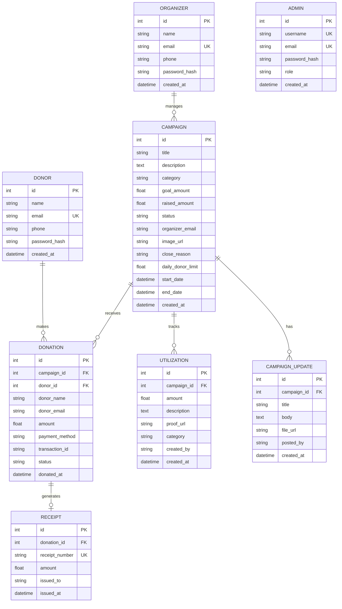

# TransFund Tracker

> **The transparent crowdfunding platform** — every rupee raised, tracked, and accounted for.

A full-stack fundraising and fund transparency platform where donors can browse campaigns, donate, and see exactly how their money was spent — and where organizers manage campaigns, log utilizations with proof, and post live updates.

---

## What Makes It Special:

- **Zero platform fee** — 100% of donations reach the campaign
- **Daily donor limits** — organizers can cap how much a single donor contributes per day
- **Fund utilization tracking** — every rupee spent is logged with description, category, and proof document
- **Proportional impact reports** — donors see their personal share of every utilization (your ₹500 bought 3 books, your ₹200 covered transport, etc.)
- **Campaign updates feed** — organizers post progress updates with file attachments
- **Auto-completion** — campaigns mark themselves as completed the moment the goal is reached
- **Cascading delete** — closing a campaign cleans up donations, receipts, utilizations, updates, and the uploaded image atomically
- **Receipt generation** — every donation gets a uniquely numbered receipt (`RCP-00001` format)

---

## Tech Stack:

| Layer | Technology |
|-------|------------|
| Frontend | Next.js 16, React 19, TypeScript |
| Styling | Tailwind CSS v4 |
| Animations | Framer Motion |
| Charts | Recharts |
| Icons | Lucide React |
| Backend | FastAPI (Python) |
| Database | PostgreSQL |
| ORM | SQLAlchemy |
| File Uploads | FastAPI StaticFiles + multipart/form-data |
| Auth | bcrypt password hashing |

---

## Getting Started

### Prerequisites
- Node.js 18+
- Python 3.10+
- PostgreSQL running locally with a database named `mini`

```sql
CREATE DATABASE mini;
```

### Frontend

```bash
npm install
npm run dev
```

Open [http://localhost:3000](http://localhost:3000)

### Backend

```bash
cd backend
pip install -r requirements.txt
python -m uvicorn main:app --reload --port 8000
```

API docs at [http://localhost:8000/docs](http://localhost:8000/docs)

> Backend reads DB credentials from `backend/.env`. Default: `postgres` / `1234` / `mini`

---

## Features

### Landing Page
- Hero section with animated gradient and floating category badges
- Auto-advancing campaign slideshow (5 slides, 5s interval)
- 8 fundraising categories grid with emoji icons
- "How it works" 3-step breakdown
- Success stories with real donor testimonials
- Trust & Safety / "Giving Guarantee" section
- Responsive navbar with dropdown menus and mobile hamburger menu
- 4-column footer with navigation and legal links

### Authentication
- Role-based login — choose **Donor** or **Organizer** on the same screen
- Signup with password strength meter (Weak / Fair / Good / Strong)
- Password confirmation with live match indicator
- Animated background (gradient blobs + floating emoji circles)
- Form validation with inline error messages

### Donor Experience
| Feature | Detail |
|---------|--------|
| Campaign Browsing | Full-text search + category pills + 4 sort modes |
| Campaign Sections | Featured, Trending Now, Recently Added |
| Campaign Cards | Progress bar, funding %, image/gradient placeholder, status badge |
| Campaign Detail | Donor count, recent donors list, donation modal |
| Quick Donate | Pre-set amounts (₹500 / ₹1000 / ₹2000 / ₹5000) or custom input |
| Daily Limit Guard | Popup warning when limit reached, shows remaining allowance |
| Fund Tracking | Full utilization log with amounts, categories, and proof links |
| Impact Dashboard | Total donated, campaigns supported, proportional impact breakdown |
| Receipts | Auto-generated receipt for every donation |

### Organizer Experience
| Feature | Detail |
|---------|--------|
| Dashboard | Stats (campaigns, donations, funds raised) + daily donation chart |
| Live Feed | Real-time recent donations with donor info and amounts |
| Create Campaign | Image upload (drag & drop), category, goal, optional daily donor cap |
| Campaign Management | Filter by status, view progress, delete campaigns |
| Campaign Detail | Full donation history table, fund utilization log |
| Campaign Updates | Post updates with title, body, and file attachments |
| End Campaign | Close with a reason; locks further donations |
| Donations Ledger | Search by donor, export to CSV, grouped by campaign |
| Settings | Edit display name, logout |

### Backend Highlights
| Endpoint | Highlight |
|----------|-----------|
| `POST /donations/` | Daily limit enforcement (HTTP 429), auto-completes campaign on goal |
| `GET /donations/impact` | Proportional impact calculation per donor per campaign |
| `GET /utilizations/summary/{id}` | Total raised vs. utilized vs. remaining |
| `POST /campaigns/` | Multipart form with image upload, daily_donor_limit field |
| `DELETE /campaigns/{id}` | Cascading delete of all related records + image file |
| `POST /utilizations/` | Proof file upload to `/uploads/proofs/` |
| `GET /health` | Health check |

---

## Database Schema

### ER Diagram



---

## API Endpoints

### Campaigns `/campaigns`
| Method | Path | Description |
|--------|------|-------------|
| GET | `/campaigns/` | List all campaigns (filter: category, organizer_email) |
| GET | `/campaigns/{id}` | Get a single campaign |
| POST | `/campaigns/` | Create campaign (multipart: image, daily_donor_limit) |
| DELETE | `/campaigns/{id}` | Delete campaign + all related records |
| PATCH | `/campaigns/{id}/close` | Close campaign with a reason |

### Donations `/donations`
| Method | Path | Description |
|--------|------|-------------|
| POST | `/donations/` | Make a donation (enforces daily limit, auto-completes campaign) |
| GET | `/donations/` | List donations (filter: donor_email, organizer_email, campaign_id) |
| GET | `/donations/impact` | Donor's proportional impact across all campaigns |

### Donors `/donors`
| Method | Path | Description |
|--------|------|-------------|
| POST | `/donors/register` | Register a new donor |
| POST | `/donors/login` | Donor login |
| GET | `/donors/` | List all donors |
| GET | `/donors/{id}` | Get donor details |
| GET | `/donors/{id}/donations` | Get all donations by a donor |

### Receipts `/receipts`
| Method | Path | Description |
|--------|------|-------------|
| POST | `/receipts/` | Generate a receipt for a donation |
| GET | `/receipts/` | List receipts (filter: donor_email) |
| GET | `/receipts/{id}` | Get receipt by ID |
| GET | `/receipts/by-donation/{donation_id}` | Get receipt for a specific donation |

### Utilizations `/utilizations`
| Method | Path | Description |
|--------|------|-------------|
| POST | `/utilizations/` | Log fund utilization with proof upload |
| GET | `/utilizations/` | List utilizations (filter: campaign_id) |
| GET | `/utilizations/{id}` | Get a utilization record |
| GET | `/utilizations/summary/{campaign_id}` | Raised vs. utilized summary |

### Campaign Updates `/campaign-updates`
| Method | Path | Description |
|--------|------|-------------|
| POST | `/campaign-updates/` | Post an update with optional file attachment |
| GET | `/campaign-updates/?campaign_id=x` | Get all updates for a campaign |

### Admins `/admins`
| Method | Path | Description |
|--------|------|-------------|
| POST | `/admins/register` | Register an admin |
| POST | `/admins/login` | Admin login |
| GET | `/admins/` | List all admins |
| GET | `/admins/{id}` | Get admin details |
| DELETE | `/admins/{id}` | Delete an admin |

### Health
| Method | Path | Description |
|--------|------|-------------|
| GET | `/health` | API health check |

---

## Project Structure

```
transfund-tracker/
├── app/
│   ├── (auth)/
│   │   ├── login/page.tsx          # Donor + Organizer login (role toggle)
│   │   └── signup/page.tsx         # Donor self-registration
│   ├── (app)/
│   │   ├── donor/
│   │   │   ├── home/page.tsx       # Browse & search campaigns
│   │   │   ├── dashboard/page.tsx  # Donor impact dashboard
│   │   │   ├── campaign/[id]/      # Campaign detail + donation modal
│   │   │   └── tracking/[id]/      # Fund utilization tracker
│   │   └── organizer/
│   │       ├── dashboard/page.tsx  # Stats + charts + live feed
│   │       ├── campaigns/page.tsx  # Campaign management grid
│   │       ├── campaigns/[id]/     # Campaign detail + updates + end
│   │       ├── campaigns/new/      # Create campaign form
│   │       ├── create/page.tsx     # Create campaign (alternate route)
│   │       ├── donations/page.tsx  # Full donations ledger + CSV export
│   │       └── settings/page.tsx   # Profile settings
│   ├── layout.tsx
│   ├── page.tsx                    # Landing page
│   └── globals.css
├── components/
│   ├── Logo.tsx                    # Brand logo (image-based)
│   ├── Navbar.tsx                  # Top navigation bar
│   ├── CampaignCard.tsx            # Reusable campaign card
│   ├── CampaignList.tsx            # Campaign grid/list
│   ├── DailyDonationChart.tsx      # Line chart (donations over time)
│   ├── DonationChart.tsx           # Donation visualization
│   ├── DonationFeed.tsx            # Live donation feed
│   ├── DonorChart.tsx              # Donor analytics
│   ├── ProgressBar.tsx             # Funding progress bar
│   ├── StatCard.tsx                # Metric stat card
│   └── RequireAuth.tsx             # Auth guard HOC
├── lib/
│   └── api.ts                      # Typed API client (all endpoints)
├── backend/
│   ├── main.py                     # FastAPI app, CORS, router registration
│   ├── database.py                 # SQLAlchemy engine & session
│   ├── models.py                   # All ORM models
│   ├── schemas.py                  # Pydantic request/response schemas
│   ├── _schema_sync.py             # Auto-adds new columns on startup
│   ├── requirements.txt
│   ├── routers/
│   │   ├── campaigns.py
│   │   ├── donations.py
│   │   ├── donors.py
│   │   ├── receipts.py
│   │   ├── utilizations.py
│   │   ├── admins.py
│   │   └── auth.py
│   └── uploads/                    # Campaign images + utilization proofs
│       └── proofs/
└── public/
    └── logo.png                    # TransFund Tracker brand logo
```
