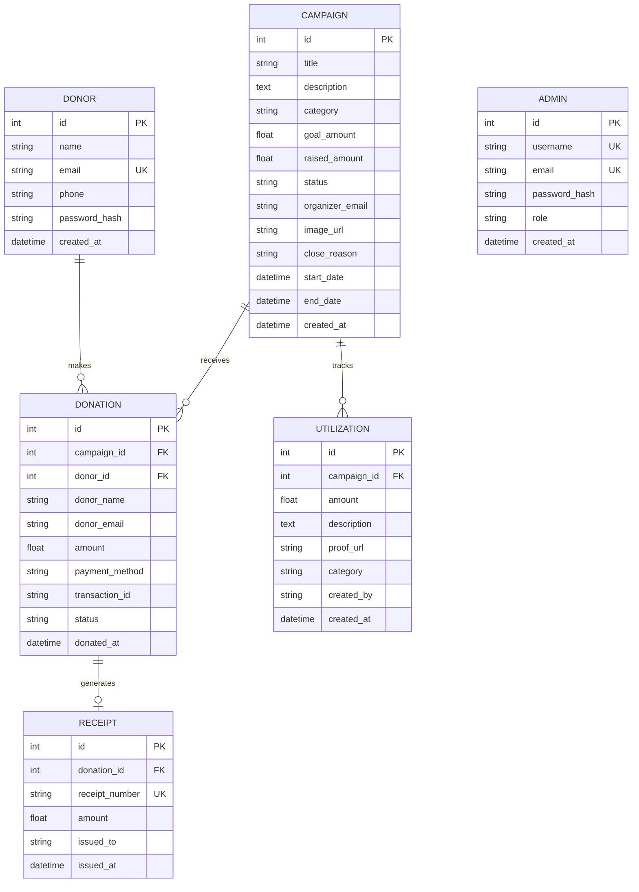

# Transfund Tracker

A full-stack crowdfunding and fund transparency platform built with **Next.js** (frontend) and **FastAPI** (backend).

---

## Tech Stack

| Layer | Technology |
|-------|------------|
| Frontend | Next.js, React, TypeScript |
| Backend | FastAPI, Python |
| Database | PostgreSQL |
| ORM | SQLAlchemy |
| Auth | bcrypt (password hashing) |

---

## Getting Started

### Frontend (Next.js)

```bash
npm install
npm run dev
```

Open [http://localhost:3000](http://localhost:3000)

### Backend (FastAPI)

```bash
cd backend
pip install -r requirements.txt
uvicorn main:app --reload
```

API docs at [http://localhost:8000/docs](http://localhost:8000/docs)

---

## Database Schema

### ER Diagram



---

### Table Details

#### 1. `donors`

| Column | Type | Constraints | Description |
|--------|------|-------------|-------------|
| `id` | Integer | PK, Auto-increment | Unique donor ID |
| `name` | String | NOT NULL | Full name |
| `email` | String | UNIQUE, NOT NULL | Login email |
| `phone` | String | Nullable | Contact number |
| `password_hash` | String | NOT NULL | Bcrypt hashed password |
| `created_at` | DateTime | Default: now | Registration timestamp |

**Relationships:** One donor → Many donations

---

#### 2. `campaigns`

| Column | Type | Constraints | Description |
|--------|------|-------------|-------------|
| `id` | Integer | PK, Auto-increment | Unique campaign ID |
| `title` | String | NOT NULL | Campaign name |
| `description` | Text | NOT NULL | Detailed description |
| `category` | String | Default: "General" | e.g. Education, Medical, Infrastructure |
| `goal_amount` | Float | Default: 0 | Target fundraising amount |
| `raised_amount` | Float | Default: 0 | Total collected so far |
| `status` | String | Default: "active" | `active` \| `completed` \| `cancelled` |
| `organizer_email` | String | NOT NULL | Campaign creator's email |
| `image_url` | String | Nullable | Campaign banner image path |
| `close_reason` | String | Nullable | Why the campaign was closed |
| `start_date` | DateTime | Nullable | When fundraising begins |
| `end_date` | DateTime | Nullable | Fundraising deadline |
| `created_at` | DateTime | Default: now | Creation timestamp |

**Relationships:** One campaign → Many donations, One campaign → Many utilizations

---

#### 3. `donations`

| Column | Type | Constraints | Description |
|--------|------|-------------|-------------|
| `id` | Integer | PK, Auto-increment | Unique donation ID |
| `campaign_id` | Integer | FK → campaigns.id, NOT NULL | Which campaign received this donation |
| `donor_id` | Integer | FK → donors.id, Nullable | Linked donor account (if registered) |
| `donor_name` | String | NOT NULL | Name of the donor |
| `donor_email` | String | NOT NULL | Email of the donor |
| `amount` | Float | NOT NULL | Donation amount |
| `payment_method` | String | Nullable | `UPI` \| `Card` \| `Bank Transfer` |
| `transaction_id` | String | Nullable | Payment gateway reference |
| `status` | String | Default: "completed" | `pending` \| `completed` \| `failed` |
| `donated_at` | DateTime | Default: now | When the donation was made |

**Relationships:** Many donations → One campaign, Many donations → One donor, One donation → One receipt

---

#### 4. `receipts`

| Column | Type | Constraints | Description |
|--------|------|-------------|-------------|
| `id` | Integer | PK, Auto-increment | Unique receipt ID |
| `donation_id` | Integer | FK → donations.id, UNIQUE, NOT NULL | One receipt per donation |
| `receipt_number` | String | UNIQUE, NOT NULL | Auto-generated (`RCP-00001`) |
| `amount` | Float | NOT NULL | Receipt amount (mirrors donation) |
| `issued_to` | String | NOT NULL | Donor name on receipt |
| `issued_at` | DateTime | Default: now | When the receipt was issued |

**Relationships:** One receipt → One donation

---

#### 5. `utilizations`

| Column | Type | Constraints | Description |
|--------|------|-------------|-------------|
| `id` | Integer | PK, Auto-increment | Unique utilization ID |
| `campaign_id` | Integer | FK → campaigns.id, NOT NULL | Which campaign's funds were used |
| `amount` | Float | NOT NULL | Amount spent |
| `description` | Text | NOT NULL | What funds were used for |
| `proof_url` | String | Nullable | Uploaded invoice/bill proof |
| `category` | String | Default: "general" | `logistics` \| `medical` \| `infrastructure` \| `general` |
| `created_by` | String | NOT NULL | Organizer email who logged it |
| `created_at` | DateTime | Default: now | When the record was created |

**Relationships:** Many utilizations → One campaign

---

#### 6. `admins`

| Column | Type | Constraints | Description |
|--------|------|-------------|-------------|
| `id` | Integer | PK, Auto-increment | Unique admin ID |
| `username` | String | UNIQUE, NOT NULL | Admin username |
| `email` | String | UNIQUE, NOT NULL | Admin email |
| `password_hash` | String | NOT NULL | Bcrypt hashed password |
| `role` | String | Default: "moderator" | `super_admin` \| `moderator` |
| `created_at` | DateTime | Default: now | Account creation timestamp |

---

## API Endpoints

### Campaigns `/campaigns`
| Method | Path | Description |
|--------|------|-------------|
| GET | `/campaigns/` | List all campaigns (filter by category, organizer_email) |
| GET | `/campaigns/{id}` | Get a single campaign |
| POST | `/campaigns/` | Create a campaign (multipart form with optional image) |
| PATCH | `/campaigns/{id}/close` | Close a campaign with a reason |

### Donations `/donations`
| Method | Path | Description |
|--------|------|-------------|
| POST | `/donations/` | Make a donation |
| GET | `/donations/` | List donations (filter by donor_email, organizer_email, campaign_id) |

### Donors `/donors`
| Method | Path | Description |
|--------|------|-------------|
| POST | `/donors/register` | Register a new donor |
| POST | `/donors/login` | Donor login |
| GET | `/donors/` | List all donors |
| GET | `/donors/{id}` | Get donor details |
| GET | `/donors/{id}/donations` | Get all donations by a donor |

### Receipts `/receipts`
| Method | Path | Description |
|--------|------|-------------|
| POST | `/receipts/` | Generate a receipt for a donation |
| GET | `/receipts/` | List receipts (filter by donor_email) |
| GET | `/receipts/{id}` | Get a receipt by ID |
| GET | `/receipts/by-donation/{donation_id}` | Get receipt for a specific donation |

### Utilizations `/utilizations`
| Method | Path | Description |
|--------|------|-------------|
| POST | `/utilizations/` | Log fund utilization (with optional proof upload) |
| GET | `/utilizations/` | List utilizations (filter by campaign_id) |
| GET | `/utilizations/{id}` | Get a utilization record |
| GET | `/utilizations/summary/{campaign_id}` | Get utilized vs raised summary |

### Admins `/admins`
| Method | Path | Description |
|--------|------|-------------|
| POST | `/admins/register` | Register an admin |
| POST | `/admins/login` | Admin login |
| GET | `/admins/` | List all admins |
| GET | `/admins/{id}` | Get admin details |
| DELETE | `/admins/{id}` | Delete an admin |

### Health
| Method | Path | Description |
|--------|------|-------------|
| GET | `/health` | API health check |

---

## Pydantic Schemas

### Donor
```python
# Create
DonorCreate(name, email, phone?, password)

# Response
DonorOut(id, name, email, phone?, created_at)

# Auth
DonorLogin(email, password)
```

### Campaign
```python
# Create
CampaignCreate(title, description, category, goal_amount, organizer_email, image_url?, start_date?, end_date?)

# Response
CampaignOut(id, title, description, category, goal_amount, raised_amount, status, organizer_email, image_url?, close_reason?, start_date?, end_date?, created_at)
```

### Donation
```python
# Create
DonationCreate(campaign_id, donor_name, donor_email, amount, donor_id?, payment_method?, transaction_id?)

# Response
DonationOut(id, campaign_id, donor_id?, donor_name, donor_email, amount, payment_method?, transaction_id?, status, donated_at, campaign_title?)
```

### Receipt
```python
# Create
ReceiptCreate(donation_id)

# Response
ReceiptOut(id, donation_id, receipt_number, amount, issued_to, issued_at)
```

### Utilization
```python
# Create
UtilizationCreate(campaign_id, amount, description, category?, proof_url?, created_by)

# Response
UtilizationOut(id, campaign_id, amount, description, proof_url?, category, created_by, created_at)
```

### Admin
```python
# Create
AdminCreate(username, email, password, role?)

# Response
AdminOut(id, username, email, role, created_at)

# Auth
AdminLogin(email, password)
```

---

## Project Structure

```
transfund-tracker/
├── app/                        # Next.js frontend
│   ├── (app)/
│   │   ├── donor/              # Donor pages
│   │   └── organizer/          # Organizer pages
│   └── (auth)/
│       └── login/              # Auth pages
├── backend/
│   ├── main.py                 # FastAPI app entry point
│   ├── database.py             # SQLAlchemy engine & session
│   ├── models.py               # 6 SQLAlchemy models
│   ├── schemas.py              # Pydantic request/response schemas
│   ├── requirements.txt        # Python dependencies
│   ├── routers/
│   │   ├── campaigns.py        # Campaign CRUD
│   │   ├── donations.py        # Donation endpoints
│   │   ├── donors.py           # Donor registration & auth
│   │   ├── receipts.py         # Receipt generation
│   │   ├── utilizations.py     # Fund utilization tracking
│   │   └── admins.py           # Admin management
│   └── uploads/                # Uploaded files (images, proofs)
├── components/                 # Shared React components
├── lib/                        # API client & utilities
└── package.json
```
